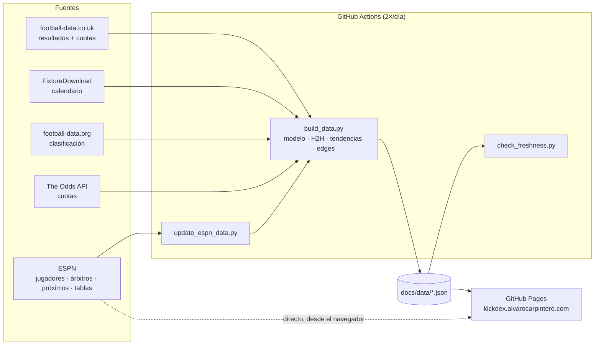

<div align="center">

<a href="https://kickdex.alvarocarpintero.com">
  <picture>
    <source media="(prefers-color-scheme: light)" srcset="docs/brand/kickdex-logo-light.svg">
    
  </picture>
</a>

### La terminal de inteligencia futbolística

Calendario, previas, comparador, jugadores, árbitros, clasificación y directo de **11 ligas europeas**.<br>
Datos partido a partido, actualizados solos cada día. **Sin login. Sin anuncios. Sin picks.**

[](https://kickdex.alvarocarpintero.com)
[](https://github.com/alvaarocl/kickdex/actions/workflows/update_data.yml)
[](requirements.txt)
[](#arquitectura)
[](#fuentes-de-datos)

[**Abrir la app →**](https://kickdex.alvarocarpintero.com) &nbsp;·&nbsp; [Metodología](https://kickdex.alvarocarpintero.com/methodology.html) &nbsp;·&nbsp; [Cobertura](https://kickdex.alvarocarpintero.com/coverage.html)

<br>


</div>

---

## Índice

- [Qué hace](#qué-hace)
- [Cobertura](#cobertura)
- [Arquitectura](#arquitectura)
- [Automatización](#automatización)
- [Fuentes de datos](#fuentes-de-datos)
- [El modelo](#el-modelo)
- [Desarrollo local](#desarrollo-local)
- [Estructura del repositorio](#estructura-del-repositorio)
- [Límites conocidos](#límites-conocidos)
- [Uso responsable y legal](#uso-responsable-y-legal)

---

## Qué hace

<table>
<tr>
<td width="50%" valign="top">

**Ficha de partido**<br>
Previa con probabilidades 1X2 (Poisson + Dixon-Coles), marcadores más probables, líneas Over/Under, duelo de 12 métricas, frecuencias de apuesta con muestra visible `(n/N)` y alertas. Pestañas de H2H, forma, árbitro y jugadores.

</td>
<td width="50%" valign="top">

**Comparador**<br>
Dos equipos cualquiera frente a frente: estadísticas local/visitante ponderadas por antigüedad, radar, modelo, H2H completo y jugadores. Exportable como informe.

</td>
</tr>
<tr>
<td></td>
<td></td>
</tr>
<tr>
<td valign="top">

**Jugadores: faltas, tarjetas y ataque**<br>
Faltas cometidas y recibidas, amarillas, tiros y goles por jugador, con ventana *Temporada / últimos 5, 10, 15* y frecuencias `1+ / 2+ / 3+`. Ranking por liga en medias, totales o últimos 5.

</td>
<td valign="top">

**Árbitros**<br>
Perfil disciplinario de cada árbitro en activo: amarillas, rojas y faltas por partido comparadas con su liga, sus últimos partidos y el ranking de la liga.

</td>
</tr>
<tr>
<td></td>
<td></td>
</tr>
<tr>
<td valign="top">

**Clasificación**<br>
Tabla y goleadores de las 11 ligas, con zonas (Champions, ascenso, playoff, descenso), forma de los últimos 5 y ataque/defensa coloreados.

</td>
<td valign="top">

**Directo**<br>
Marcadores casi en tiempo real (< 1 min) con minuto, goleadores y expulsiones. Si no hay partidos, muestra los próximos y los últimos resultados.

</td>
</tr>
<tr>
<td></td>
<td></td>
</tr>
</table>

<details>
<summary><b>Ficha de árbitro</b></summary>
<br>

</details>

---

## Cobertura

| Liga | Calendario | Estadísticas de equipo | Jugadores | Árbitros | Clasificación |
|---|:-:|:-:|:-:|:-:|:-:|
| 🇪🇸 LaLiga · Segunda División | ✅ | ✅ | ✅ | ✅ | ✅ |
| 🏴󠁧󠁢󠁥󠁮󠁧󠁿 Premier League · Championship | ✅ | ✅ | ✅ | ✅ | ✅ |
| 🇮🇹 Serie A · Serie B | ✅ | ✅ | ✅ | ✅ | ✅ |
| 🇩🇪 Bundesliga · 2. Bundesliga | ✅ | ✅ | ✅ | ✅ | ✅ |
| 🇫🇷 Ligue 1 · Ligue 2 | ✅ | ✅ | ✅ | ✅ | ✅ |
| 🇳🇱 Eredivisie | ✅ | ✅ | ✅ | ✅ | ✅ |

**~93.000 partidos** históricos desde 2004/05 · **216 equipos** · **~4.900 jugadores** con registro partido a partido · árbitros en activo de las 11 ligas. El detalle vivo está en la [página de cobertura](https://kickdex.alvarocarpintero.com/coverage.html).

---

## Arquitectura

KICKDEX es **estático**: la web es HTML/CSS/JS sin frameworks servido por GitHub Pages, y los datos son JSON generados por un pipeline batch en GitHub Actions. No hay servidor ni base de datos en producción.



- **Frontend** (`docs/`): JavaScript vanilla modular. Los bloques de análisis (`docs/js/blocks/`) se comparten entre la ficha de partido y el Comparador.
- **Pipeline** (`app/`, `scripts/`): Python + pandas. Descarga, normaliza nombres de equipo, calcula y escribe los JSON con contratos estables.
- **Directo**: el navegador consulta el marcador público de ESPN cada 30 s mientras la pestaña está abierta; si falla, cae al JSON con retraso.

---

## Automatización

Todo se actualiza solo; no hay que tocar nada entre temporadas.

| Workflow | Cuándo | Qué hace |
|---|---|---|
| [`update_data.yml`](.github/workflows/update_data.yml) | 06:10 y 13:10 UTC | Sincroniza ESPN, cuotas, clasificación y regenera todos los JSON (~4 min). Termina con un vigilante de frescura que **falla (y avisa por email)** si algún dato se queda viejo. |
| [`update_standings.yml`](.github/workflows/update_standings.yml) | 05:20 UTC | Clasificación y goleadores. |
| [`update_live_scores.yml`](.github/workflows/update_live_scores.yml) | periódico | Copia de respaldo del directo. |
| [`update_player_photos.yml`](.github/workflows/update_player_photos.yml) | lunes | Fotos de jugadores (Wikidata / Wikimedia Commons). |

- La **temporada se calcula sola** (cambia el 1 de julio); se puede forzar con `KICKDEX_SEASON_YEAR`.
- La sincronización con ESPN es **incremental** (solo partidos nuevos) y con presupuesto de tiempo.
- Los CSV históricos se cachean entre ejecuciones.

---

## Fuentes de datos

| Fuente | Uso |
|---|---|
| [football-data.co.uk](https://www.football-data.co.uk) | Resultados, estadísticas de equipo y cuotas de cierre desde 2004/05. |
| [FixtureDownload](https://fixturedownload.com) | Calendario completo de 7 ligas. |
| ESPN (marcador público) | Estadísticas de jugador y árbitro por partido, próximos partidos de las segundas divisiones, clasificaciones y directo. API no oficial. |
| [football-data.org](https://www.football-data.org) | Clasificación y goleadores (plan gratuito). |
| [The Odds API](https://the-odds-api.com) | Cuotas de mercado para el cálculo de edge (5 grandes ligas). |
| World Soccer Data | Histórico arbitral de temporadas anteriores. |
| [football-logos](https://github.com/JoseArroyave/football-logos) · Wikidata | Escudos (MIT) y fotos de jugador. Las marcas pertenecen a sus clubes. |

---

## El modelo

- **Forma ponderada por antigüedad**: cada partido pesa `0.5^(días / 270)`; lo reciente cuenta más sin descartar el histórico.
- **Probabilidades**: Poisson bivariante con corrección **Dixon-Coles**, mezclado con el H2H (orientado local/visitante).
- **Edge**: probabilidad del modelo frente a la probabilidad implícita de la cuota (`1 / cuota`). Se publica con su backtest.
- **Frecuencias con muestra visible**: toda tasa se muestra como `n/N`, nunca como porcentaje suelto.

Detalle completo en la [metodología](https://kickdex.alvarocarpintero.com/methodology.html).

---

## Desarrollo local

```bash
# Web (sin dependencias)
cd docs && python -m http.server 8080        # http://localhost:8080

# Pipeline
pip install -r requirements.txt
python scripts/update_espn_data.py           # jugadores, árbitros, próximos, tablas
python scripts/build_data.py                 # genera docs/data/*.json

# Iterar rápido sin descargas
KICKDEX_SKIP_DOWNLOADS=1 KICKDEX_SKIP_FIXTURE_DOWNLOADS=1 python scripts/build_data.py

# Tests y validación
python -m pytest tests -q
python scripts/validate_static_data.py
python scripts/check_freshness.py
```

<details>
<summary><b>Variables de entorno</b></summary>

| Variable | Para qué |
|---|---|
| `FOOTBALL_DATA_API_KEY` | Clasificación y goleadores de football-data.org (sin ella se usa ESPN). |
| `THE_ODDS_API_KEY` | Cuotas para edges en próximos partidos. |
| `KICKDEX_SEASON_YEAR` | Forzar una temporada (por defecto se calcula por fecha). |
| `KICKDEX_SKIP_DOWNLOADS` / `KICKDEX_SKIP_FIXTURE_DOWNLOADS` | Reutilizar los CSV locales. |
| `KICKDEX_SKIP_HEAVY_REBUILD` | Conservar H2H, tendencias y edges ya generados. |

</details>

<details>
<summary><b>Otras utilidades</b></summary>

- **Imágenes Open Graph por partido**: `python -m app.og --home "Real Madrid" --away "Barcelona" --league "LA LIGA"` → `docs/og/`.
- **Informe de partido**: `docs/report.html?homeKey=…&awayKey=…` genera un informe exportable a PDF en el navegador.
- **Histórico arbitral (World Soccer Data)**: bloquea las IPs de GitHub; se refresca desde local con `python scripts/update_worldsoccerdata_referee_data.py`.

</details>

---

## Estructura del repositorio

```
kickdex/
├── docs/                      Producto público (GitHub Pages)
│   ├── index.html             App: Inicio, Comparador, Jugadores, Árbitros, Directo, Clasificación
│   ├── match.html · player.html · referee.html · report.html
│   ├── methodology.html · coverage.html · páginas legales
│   ├── js/                    Módulos vanilla + js/blocks/ (bloques compartidos)
│   ├── css/app.css            Sistema visual (tokens de marca, tablas con calor)
│   ├── brand/                 Logos y guía de marca
│   └── data/                  JSON generados — no editar a mano
├── app/
│   ├── data/                  Carga, normalización de equipos, calendario, activos
│   └── engine/                Probabilidad, métricas ponderadas, alertas, edge
├── scripts/                   Pipeline y sincronizaciones (update_*.py, build_data.py)
├── tests/                     pytest (130 tests)
├── DATOS/                     CSV de origen y registros partido a partido versionados
├── worker/                    Worker de Cloudflare para directo (inactivo)
├── docs_proyecto/             Contratos de datos, planes y documentación histórica
└── .github/                   Workflows y capturas del README
```

---

## Límites conocidos

KICKDEX prefiere decir “sin dato” a inventarlo:

- Los **minutos de jugador son estimados** (alineación, cambios y expulsiones, sin añadido).
- Las **cuotas** son de referencia, no una oferta; el edge es una **estimación**.
- El **directo** depende de una API pública no oficial; si falla, se muestra la copia con retraso.
- La **designación arbitral** previa al partido solo aparece si la fuente la publica antes.
- Algunas estadísticas de equipo no existen para clubes recién ascendidos desde categorías sin datos; se muestran como “—”.

---

## Uso responsable y legal

> **RISK NOTICE:** edges are estimates, not guarantees. Play responsibly.

KICKDEX ofrece análisis histórico y estadístico **con fines informativos**; no es asesoramiento de apuestas ni garantiza resultados. +18. Si el juego deja de ser un entretenimiento, busca ayuda en [jugarbien.es](https://www.jugarbien.es).

[Aviso legal](https://kickdex.alvarocarpintero.com/aviso-legal.html) · [Privacidad](https://kickdex.alvarocarpintero.com/privacidad.html) · [Cookies](https://kickdex.alvarocarpintero.com/cookies.html) · [Términos](https://kickdex.alvarocarpintero.com/terminos.html)

<div align="center">
<br>
<sub>Hecho por <a href="https://alvarocarpintero.com">Álvaro Carpintero</a> · <code>Football intelligence, indexed.</code></sub>
</div>
