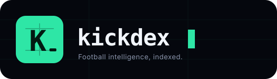
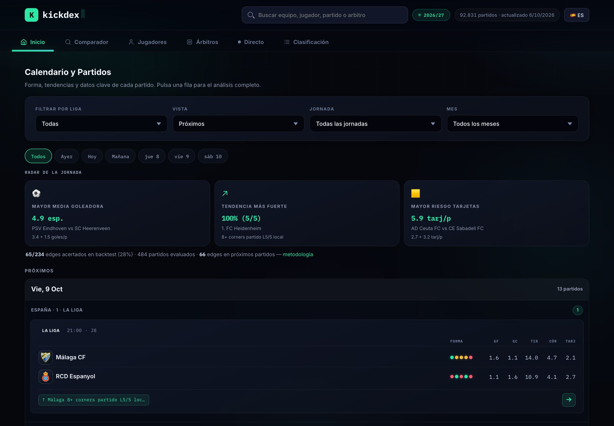
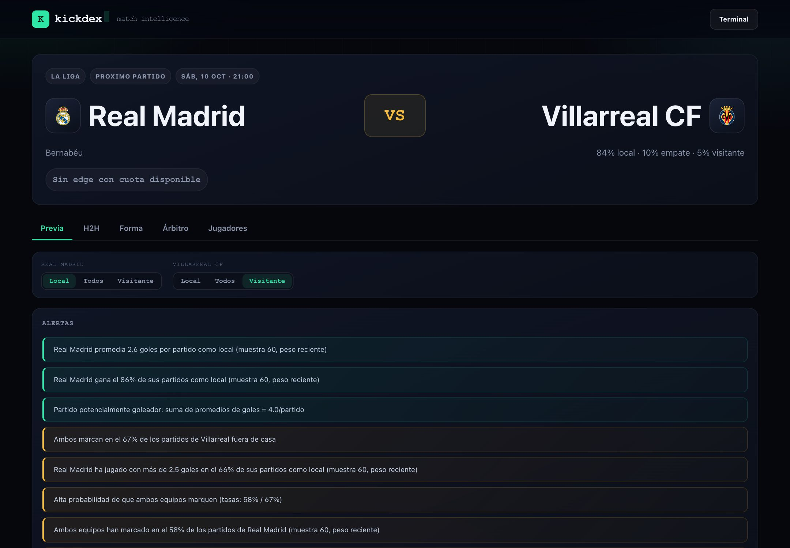
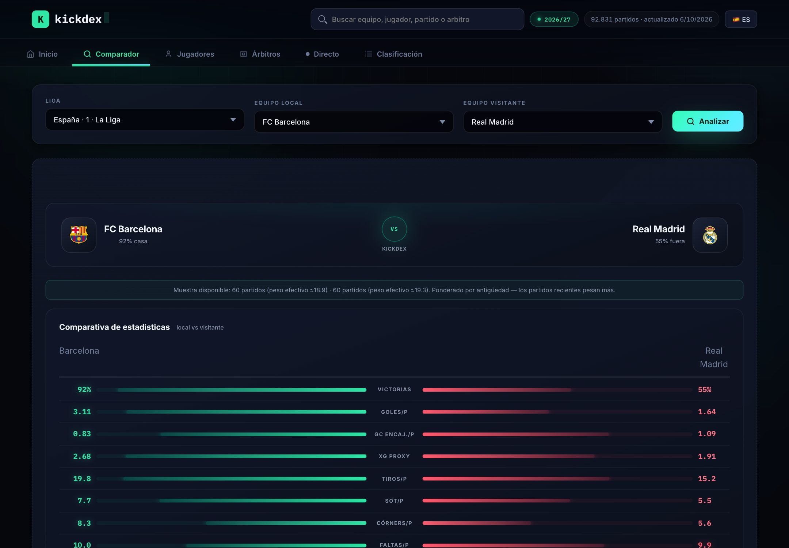
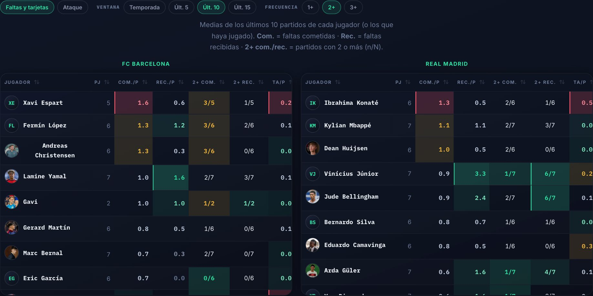
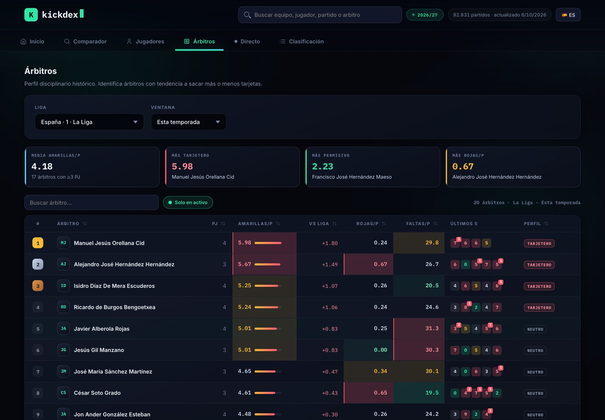
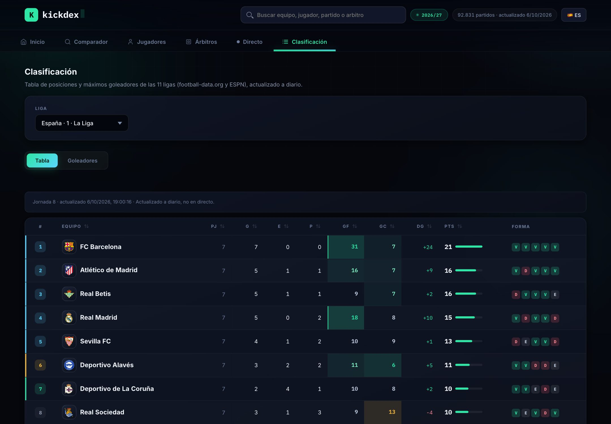
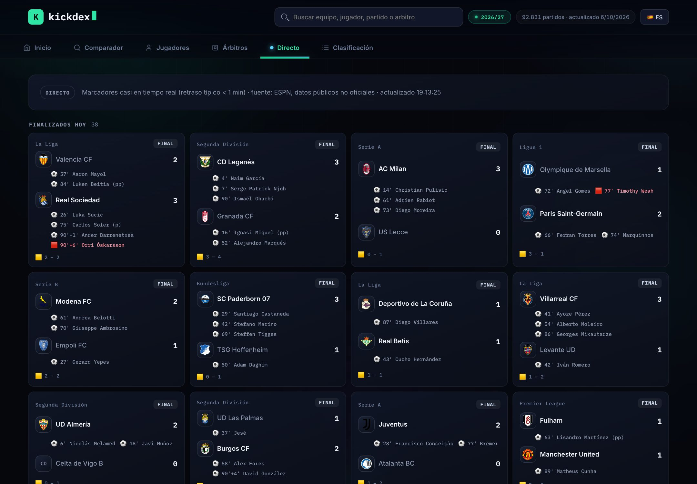
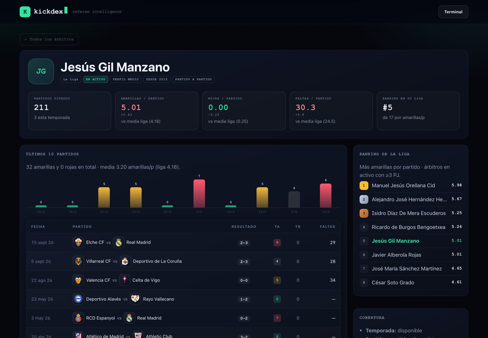

<div align="center">

<a href="https://kickdex.alvarocarpintero.com">
  <picture>
    <source media="(prefers-color-scheme: light)" srcset="docs/brand/kickdex-logo-light.svg">
    
  </picture>
</a>

### The football intelligence terminal

Fixtures, previews, team comparison, players, referees, standings and live scores for **11 European leagues**.<br>
Match-by-match data, refreshed automatically every day. **No login. No ads. No picks.**

[](https://kickdex.alvarocarpintero.com)
[](https://github.com/alvaarocl/kickdex/actions/workflows/update_data.yml)
[](requirements.txt)
[](#architecture)
[](#data-sources)

[**Open the app →**](https://kickdex.alvarocarpintero.com) &nbsp;·&nbsp; [Methodology](https://kickdex.alvarocarpintero.com/methodology.html) &nbsp;·&nbsp; [Coverage](https://kickdex.alvarocarpintero.com/coverage.html)

<br>



<sub>The interface is in Spanish, with an English language toggle.</sub>

</div>

---

## Contents

- [Features](#features)
- [Coverage](#coverage)
- [Architecture](#architecture)
- [Automation](#automation)
- [Data sources](#data-sources)
- [The model](#the-model)
- [Local development](#local-development)
- [Repository layout](#repository-layout)
- [Known limitations](#known-limitations)
- [Responsible use & legal](#responsible-use--legal)

---

## Features

<table>
<tr>
<td width="50%" valign="top">

**Match page**<br>
Preview with 1X2 probabilities (Poisson + Dixon-Coles), most likely scorelines, Over/Under lines, a 12-metric stat duel, betting-market frequencies with a visible sample `(n/N)`, and alerts. Tabs for H2H, form, referee and players.

</td>
<td width="50%" valign="top">

**Team comparison**<br>
Any two teams head to head: recency-weighted home/away stats, radar chart, model output, full H2H and players. Exportable as a report.

</td>
</tr>
<tr>
<td></td>
<td></td>
</tr>
<tr>
<td valign="top">

**Players: fouls, cards and attack**<br>
Fouls committed and suffered, yellow cards, shots and goals per player, with a *Season / last 5, 10, 15* window and `1+ / 2+ / 3+` hit rates. League leaderboards by per-match average, season totals or last 5.

</td>
<td valign="top">

**Referees**<br>
Disciplinary profile of every active referee: yellows, reds and fouls per match compared with their league, their latest matches and the league ranking.

</td>
</tr>
<tr>
<td></td>
<td></td>
</tr>
<tr>
<td valign="top">

**Standings**<br>
Tables and top scorers for all 11 leagues, with zones (Champions League, promotion, play-offs, relegation), last-5 form and heat-coloured attack/defence.

</td>
<td valign="top">

**Live**<br>
Near real-time scores (< 1 min delay) with match minute, scorers and red cards. When nothing is on, it shows the next fixtures and the latest results.

</td>
</tr>
<tr>
<td></td>
<td></td>
</tr>
</table>

<details>
<summary><b>Referee profile</b></summary>
<br>

</details>

---

## Coverage

| League | Fixtures | Team stats | Players | Referees | Standings |
|---|:-:|:-:|:-:|:-:|:-:|
| 🇪🇸 LaLiga · Segunda División | ✅ | ✅ | ✅ | ✅ | ✅ |
| 🏴󠁧󠁢󠁥󠁮󠁧󠁿 Premier League · Championship | ✅ | ✅ | ✅ | ✅ | ✅ |
| 🇮🇹 Serie A · Serie B | ✅ | ✅ | ✅ | ✅ | ✅ |
| 🇩🇪 Bundesliga · 2. Bundesliga | ✅ | ✅ | ✅ | ✅ | ✅ |
| 🇫🇷 Ligue 1 · Ligue 2 | ✅ | ✅ | ✅ | ✅ | ✅ |
| 🇳🇱 Eredivisie | ✅ | ✅ | ✅ | ✅ | ✅ |

**~93,000** historical matches since 2004/05 · **216 teams** · **~4,900 players** with match-by-match records · active referees in all 11 leagues. Live figures are on the [coverage page](https://kickdex.alvarocarpintero.com/coverage.html).

---

## Architecture

KICKDEX is **static**: the site is framework-free HTML/CSS/JS served by GitHub Pages, and the data is JSON produced by a batch pipeline on GitHub Actions. There is no server or database in production.


- **Frontend** (`docs/`): modular vanilla JavaScript. The analysis blocks (`docs/js/blocks/`) are shared between the match page and the team comparison.
- **Pipeline** (`app/`, `scripts/`): Python + pandas. Downloads, normalises team names, computes and writes JSON with stable contracts.
- **Live**: the browser polls ESPN's public scoreboard every 30 s while the tab is open; if that fails it falls back to a delayed JSON snapshot.

---

## Automation

Everything refreshes itself — nothing to touch between seasons.

| Workflow | When | What it does |
|---|---|---|
| [`update_data.yml`](.github/workflows/update_data.yml) | 06:10 and 13:10 UTC | Syncs ESPN, odds and standings, then rebuilds every JSON (~4 min). Ends with a freshness watchdog that **fails (and emails you)** if any dataset goes stale. |
| [`update_standings.yml`](.github/workflows/update_standings.yml) | 05:20 UTC | Standings and top scorers. |
| [`update_live_scores.yml`](.github/workflows/update_live_scores.yml) | periodic | Backup snapshot for the live tab. |
| [`update_player_photos.yml`](.github/workflows/update_player_photos.yml) | Mondays | Player photos (Wikidata / Wikimedia Commons). |

- The **season is computed automatically** (it rolls over on 1 July); override with `KICKDEX_SEASON_YEAR`.
- The ESPN sync is **incremental** (new matches only) and runs within a time budget.
- Historical CSVs are cached between runs.

---

## Data sources

| Source | Used for |
|---|---|
| [football-data.co.uk](https://www.football-data.co.uk) | Results, team stats and closing odds since 2004/05. |
| [FixtureDownload](https://fixturedownload.com) | Full season fixtures for 7 leagues. |
| ESPN (public scoreboard) | Per-match player and referee stats, upcoming fixtures for the second divisions, standings and live scores. Unofficial API. |
| [football-data.org](https://www.football-data.org) | Standings and top scorers (free tier). |
| [The Odds API](https://the-odds-api.com) | Market odds for edge estimates (top 5 leagues). |
| World Soccer Data | Referee history from previous seasons. |
| [football-logos](https://github.com/JoseArroyave/football-logos) · Wikidata | Club crests (MIT) and player photos. Trademarks belong to their clubs. |

---

## The model

- **Recency-weighted form**: each match weighs `0.5^(days / 270)`, so recent games count more without discarding history.
- **Probabilities**: bivariate Poisson with the **Dixon-Coles** correction, blended with the head-to-head record (oriented home/away).
- **Edge**: model probability versus the odds-implied probability (`1 / odds`), published together with its backtest.
- **Visible sample sizes**: every rate is shown as `n/N`, never as a bare percentage.

Full details in the [methodology](https://kickdex.alvarocarpintero.com/methodology.html) (Spanish).

---

## Local development

```bash
# Website (no dependencies)
cd docs && python -m http.server 8080        # http://localhost:8080

# Pipeline
pip install -r requirements.txt
python scripts/update_espn_data.py           # players, referees, upcoming fixtures, tables
python scripts/build_data.py                 # writes docs/data/*.json

# Fast iteration without downloads
KICKDEX_SKIP_DOWNLOADS=1 KICKDEX_SKIP_FIXTURE_DOWNLOADS=1 python scripts/build_data.py

# Tests and validation
python -m pytest tests -q
python scripts/validate_static_data.py
python scripts/check_freshness.py
```

<details>
<summary><b>Environment variables</b></summary>

| Variable | Purpose |
|---|---|
| `FOOTBALL_DATA_API_KEY` | Standings and top scorers from football-data.org (ESPN is used without it). |
| `THE_ODDS_API_KEY` | Odds for edges on upcoming fixtures. |
| `KICKDEX_SEASON_YEAR` | Force a season (computed from the date by default). |
| `KICKDEX_SKIP_DOWNLOADS` / `KICKDEX_SKIP_FIXTURE_DOWNLOADS` | Reuse local CSVs. |
| `KICKDEX_SKIP_HEAVY_REBUILD` | Keep previously generated H2H, trends and edges. |

</details>

<details>
<summary><b>Other utilities</b></summary>

- **Per-match Open Graph images**: `python -m app.og --home "Real Madrid" --away "Barcelona" --league "LA LIGA"` → `docs/og/`.
- **Match report**: `docs/report.html?homeKey=…&awayKey=…` builds a report exportable to PDF in the browser.
- **Referee history (World Soccer Data)**: blocks GitHub's IP ranges, so it is refreshed locally with `python scripts/update_worldsoccerdata_referee_data.py`.

</details>

---

## Repository layout

```
kickdex/
├── docs/                      Public product (GitHub Pages)
│   ├── index.html             App: Home, Compare, Players, Referees, Live, Standings
│   ├── match.html · player.html · referee.html · report.html
│   ├── methodology.html · coverage.html · legal pages
│   ├── js/                    Vanilla modules + js/blocks/ (shared blocks)
│   ├── css/app.css            Design system (brand tokens, heat-coloured tables)
│   ├── brand/                 Logos and brand guide
│   └── data/                  Generated JSON — do not edit by hand
├── app/
│   ├── data/                  Loading, team-name normalisation, fixtures, assets
│   └── engine/                Probability, weighted metrics, alerts, edge
├── scripts/                   Pipeline and syncs (update_*.py, build_data.py)
├── tests/                     pytest (130 tests)
├── DATOS/                     Source CSVs and versioned match-by-match logs
├── worker/                    Cloudflare Worker for live data (inactive)
├── docs_proyecto/             Data contracts, plans and historical docs
└── .github/                   Workflows and README screenshots
```

---

## Known limitations

KICKDEX would rather say "no data" than make it up:

- **Player minutes are estimated** (line-ups, substitutions and red cards; stoppage time not included).
- **Odds** are a reference, not an offer; the edge is an **estimate**.
- **Live scores** rely on an unofficial public API; if it fails, the delayed snapshot is shown.
- **Referee appointments** only appear before kick-off if the source publishes them.
- Some team stats don't exist for clubs promoted from tiers without data; they are shown as “—”.

---

## Responsible use & legal

> **RISK NOTICE:** edges are estimates, not guarantees. Play responsibly.

KICKDEX provides historical and statistical analysis **for informational purposes only**; it is not betting advice and does not guarantee outcomes. 18+ only. If gambling stops being fun, get help at [jugarbien.es](https://www.jugarbien.es) (Spain) or [begambleaware.org](https://www.begambleaware.org).

[Legal notice](https://kickdex.alvarocarpintero.com/aviso-legal.html) · [Privacy](https://kickdex.alvarocarpintero.com/privacidad.html) · [Cookies](https://kickdex.alvarocarpintero.com/cookies.html) · [Terms](https://kickdex.alvarocarpintero.com/terminos.html)

<div align="center">
<br>
<sub>Built by <a href="https://alvarocarpintero.com">Álvaro Carpintero</a> · <code>Football intelligence, indexed.</code></sub>
</div>
